# Error report

ckpt: `results/physics/checkpoints/dimenet_pp_enhanced_physics_seed0_physics.pt`

| element   |      n |      wmae |   polar_mae |
|:----------|-------:|----------:|------------:|
| I         |    116 | 0.396202  |   0.029755  |
| Se        |     17 | 0.338742  |   0.0430353 |
| Te        |      2 | 0.337685  |   0.0919444 |
| Bi        |      1 | 0.325417  |   0.0327104 |
| Br        |    486 | 0.311678  |   0.0182203 |
| Cl        |   1952 | 0.292324  |   0.0192394 |
| S         |    798 | 0.241718  |   0.040061  |
| F         |   1810 | 0.236106  |   0.0189018 |
| As        |     12 | 0.229681  |   0.0536195 |
| Si        |    251 | 0.204636  |   0.0273314 |
| Sb        |      3 | 0.199084  |   0.0548104 |
| B         |     61 | 0.187039  |   0.016532  |
| O         |  13844 | 0.145997  |   0.0464659 |
| C         |  81635 | 0.145605  |   0.010412  |
| Ge        |      5 | 0.144534  |   0.0348106 |
| P         |    180 | 0.118555  |   0.0258469 |
| N         |   6169 | 0.110927  |   0.0449887 |
| H         | 114406 | 0.0732799 |   0.0108417 |

## Area error by element (robust)
| element   |      n |   area_abs_err_median |   area_abs_err_p90 |   area_rel_err_median |   area_rel_err_p90 |
|:----------|-------:|----------------------:|-------------------:|----------------------:|-------------------:|
| Sb        |      3 |           0.00127935  |        0.00290515  |            0.0464566  |         2.65857    |
| Te        |      2 |           0.00114204  |        0.0014156   |            0.034309   |         0.0426943  |
| Ge        |      5 |           0.000761426 |        0.00174425  |            0.125385   |         0.283301   |
| Se        |     17 |           0.000749012 |        0.000929405 |            0.0241     |         0.0295447  |
| Si        |    251 |           0.000606041 |        0.00154104  |            0.0503266  |         0.122402   |
| P         |    180 |           0.000519557 |        0.00110348  |            0.110944   |         0.27003    |
| As        |     12 |           0.000429192 |        0.000882035 |            0.024674   |         0.0541551  |
| S         |    798 |           0.00036996  |        0.00100536  |            0.019979   |         0.0671807  |
| I         |    116 |           0.00032508  |        0.00120226  |            0.00642129 |         0.0242138  |
| B         |     61 |           0.000309605 |        0.00105589  |            0.0340088  |         0.143006   |
| Br        |    486 |           0.000267778 |        0.000873083 |            0.00656923 |         0.022279   |
| N         |   6169 |           0.000215964 |        0.00069301  |            0.0282669  |         0.149416   |
| Cl        |   1952 |           0.000211295 |        0.000733459 |            0.00624414 |         0.0222333  |
| F         |   1810 |           0.000189729 |        0.000630681 |            0.0102814  |         0.0350943  |
| Bi        |      1 |           0.000155821 |        0.000155821 |            0.00643048 |         0.00643048 |
| O         |  13844 |           0.00015395  |        0.000537027 |            0.0104739  |         0.047631   |
| C         |  81635 |           0.000106763 |        0.000376511 |            0.0114435  |         0.0605693  |
| H         | 114406 |           3.72706e-05 |        0.000216373 |            0.0060192  |         0.0394202  |

## By molecule size
| size_bin   |      n |      wmae |   polar_mae |
|:-----------|-------:|----------:|------------:|
| (0, 10]    |   1707 | 0.175207  |  0.0346469  |
| (10, 20]   |  30047 | 0.1255    |  0.023743   |
| (20, 35]   | 109684 | 0.109787  |  0.0148918  |
| (35, 60]   |  73217 | 0.104426  |  0.00964021 |
| (60, 1000] |   7093 | 0.0988645 |  0.00421184 |

## By functional group
| group       |   n_molecules |   n_atoms |   wmae_in |   wmae_out |        delta |
|:------------|--------------:|----------:|----------:|-----------:|-------------:|
| halogen     |          1929 |     41003 |  0.124894 |   0.10699  |  0.0179046   |
| aromatic    |          3848 |    109780 |  0.116144 |   0.104571 |  0.0115727   |
| ring        |          4748 |    137564 |  0.113565 |   0.104966 |  0.00859887  |
| nitrogen    |          3582 |     99404 |  0.114933 |   0.106536 |  0.00839726  |
| sulfur      |           700 |     18473 |  0.117822 |   0.109617 |  0.00820539  |
| charged     |           941 |     24308 |  0.117544 |   0.109409 |  0.00813552  |
| triple_bond |           510 |     14202 |  0.112546 |   0.110147 |  0.00239877  |
| oxygen      |          5932 |    173071 |  0.110294 |   0.110323 | -2.92882e-05 |
| carbonyl    |          3297 |     99170 |  0.109335 |   0.111081 | -0.00174651  |

## 8 worst molecules

### #1  mol_id=42397  wMAE=0.964
`FC(F)=S`

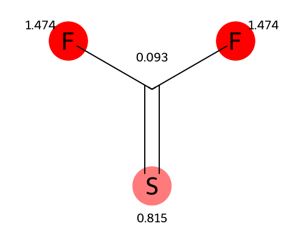
(atom labels = per-atom wMAE, redder = worse; if SMILES atom order doesn't match atom_index this image is silently skipped, not mislabeled)

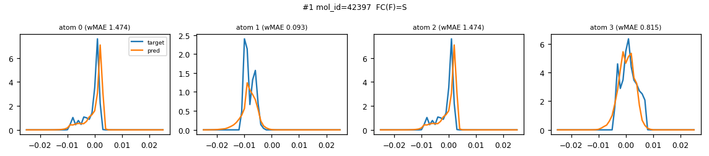

### #2  mol_id=49469  wMAE=0.527
`O=S(=O)([O-])c1cccc(S(=O)(=O)[O-])c1`

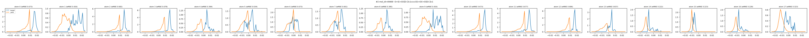

### #3  mol_id=49107  wMAE=0.518
`O=NC(F)=C(F)F`

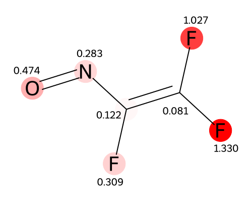
(atom labels = per-atom wMAE, redder = worse; if SMILES atom order doesn't match atom_index this image is silently skipped, not mislabeled)

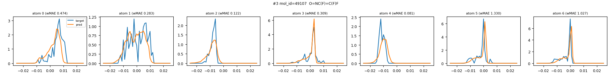

### #4  mol_id=42336  wMAE=0.452
`FC(F)=C(F)B(Cl)C(F)=C(F)F`

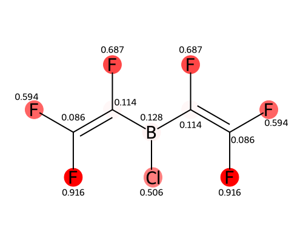
(atom labels = per-atom wMAE, redder = worse; if SMILES atom order doesn't match atom_index this image is silently skipped, not mislabeled)

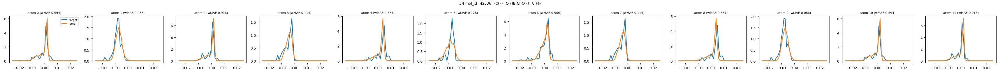

### #5  mol_id=40567  wMAE=0.435
`ClC(Cl)(I)I`

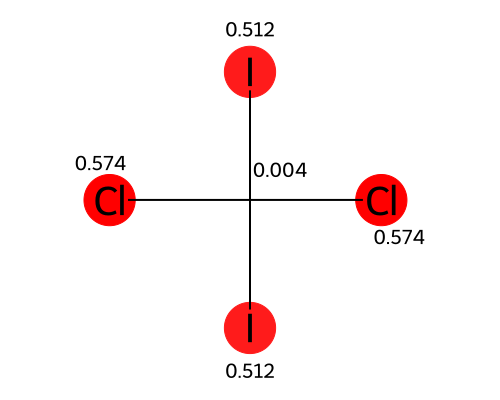
(atom labels = per-atom wMAE, redder = worse; if SMILES atom order doesn't match atom_index this image is silently skipped, not mislabeled)

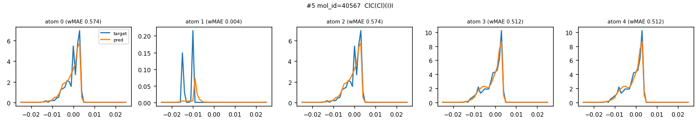

### #6  mol_id=42337  wMAE=0.402
`FC(F)=C(F)B(Cl)Cl`

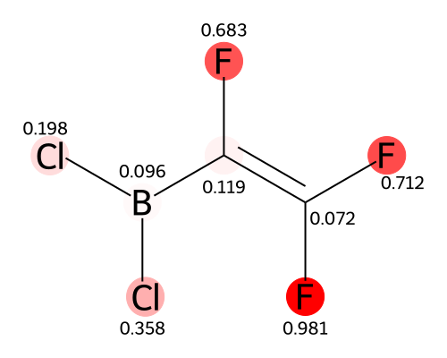
(atom labels = per-atom wMAE, redder = worse; if SMILES atom order doesn't match atom_index this image is silently skipped, not mislabeled)

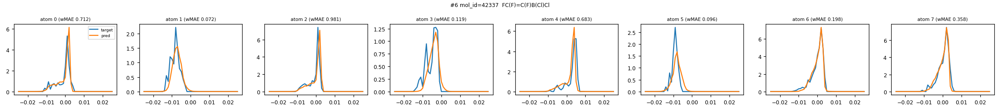

### #7  mol_id=49695  wMAE=0.384
`O=[N+]([O-])C(F)(F)F`

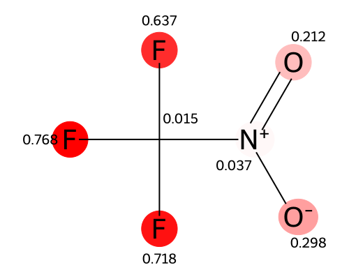
(atom labels = per-atom wMAE, redder = worse; if SMILES atom order doesn't match atom_index this image is silently skipped, not mislabeled)

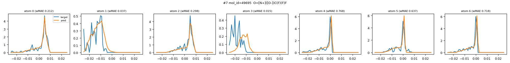

### #8  mol_id=40556  wMAE=0.359
`ClC(Cl)(Cl)I`

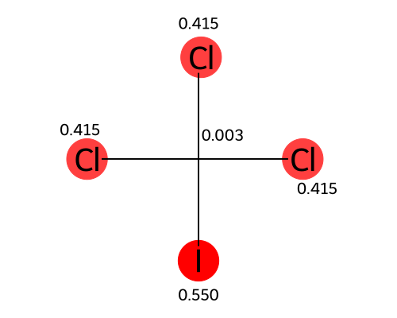
(atom labels = per-atom wMAE, redder = worse; if SMILES atom order doesn't match atom_index this image is silently skipped, not mislabeled)

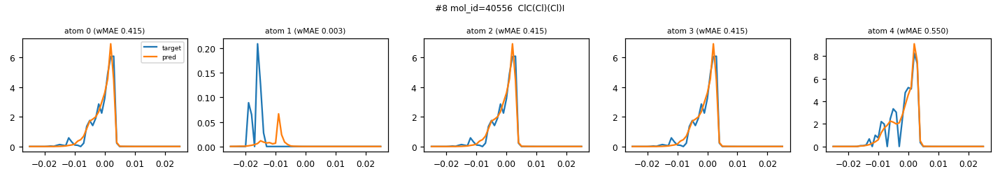
